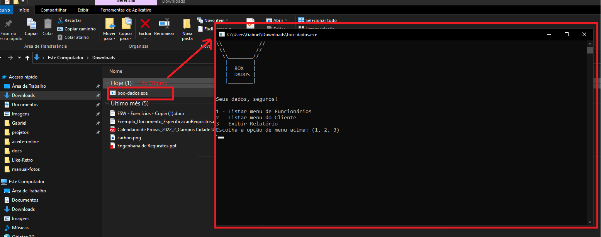
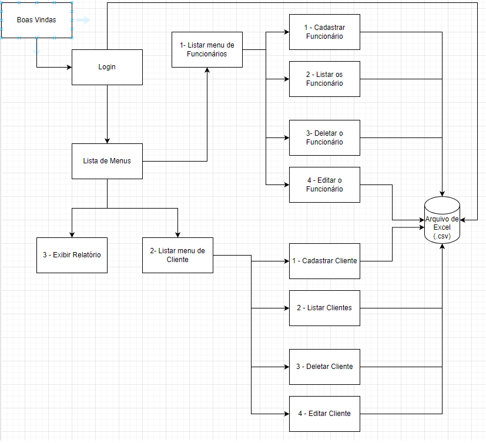
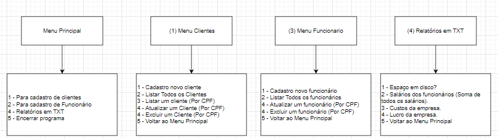
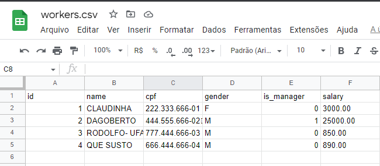

# Box-Dados
## O que é?
Um sistema desenvolvido na linguagem C.  
Possibilitando o operador:
- Listar / Cadastrar / Atualizar / Excluir => Funcionario (Pode ser Gerente ou não)
- Listar / Cadastrar / Atualizar / Excluir => Clientes
- (ToDo) Relatorio: Listar custo mensal da empresa


### Conceitos abordados:
- Conditional / Loop 
- Functions 
- Structs 
- References
- Correção de acentuação no Windows (setLocale is Sux!)
- I/O Files Persistir em (.csv)  


### Copilar e Executar (local) ?!  
Execute o comando
```shell
gcc -o binary worker.c && binary
```

### Copilar e Executar no Windows via terminal ?!
Execute o comando
```shell
gcc -o dist/box-dados.exe worker.c && dist\box-dados.exe 1
```


### Executar modo Windows?
Baixe o arquivo executável:  
https://github.com/gabrieldarezzo/aceite-online/blob/main/dist/aceite-online.exe
 
    
E clique 2x no arquivo `box-dados.exe`


#### Acentuação do DevC++ 
Problemas com acentuação ao Run/Compile via 'DevC++' ?

Na função main altere:

De:
```c
system("chcp 65001");
// setlocale(LC_ALL, "Portuguese");
```

Para:
```c
// system("chcp 65001");
setlocale(LC_ALL, "Portuguese");
```
  
## Fluxograma

    
    


### GoogleDrive:
https://app.diagrams.net/#G1qRgqKxPBZyYuL1YDv5Tw2RoON5Od_gRE   

### Static-File:
Ou uma versão estatica: `docs/fluxo_drawio.xml`  


### Planilha de dados (storage/persons.csv)
https://docs.google.com/spreadsheets/d/1eMlOSFpCK09SJYl4bYadGosuIpcc6fSVmUAPV1VW3GI/edit?usp=sharing  
 
    


## Estrutura principal:

```markdown
struct Person
---------------------------------------------
int id;
char name[250];
char cpf[14];
int person_type;
char gender[1];
float salary;
int is_deleted;
```


## Dicas:
In VSCode:    
Utilizar Doxygen (Extensão para criar docBlock, Ex:)   
```c
/**
 * @brief Pass a cpf as a string to delete them from struct Person (Global Person)
 * 
 * @global persons
 * @param cpfPersonToDelete 
 * @return struct Person 
 */
struct Person deletePerson(char *cpfPersonToDelete) {
    struct Person personTemp;
    ...
    ...
    return personTemp;
}
```


Generate .exe inside of Linux/Mac
```shell
x86_64-w64-mingw32-g++ -o dist/box-dados.exe exercicios/menu_simple.c
```

Topicos para estudar:  
- `malloc()` : https://www.programiz.com/c-programming/c-structures-pointers
- https://opensource.com/article/19/5/how-write-good-c-main-function
- https://pt.stackoverflow.com/questions/125793/qual-o-significado-do-operador-e-comercial-na-linguagem-c#:~:text=Portanto%2C%20conclui%2Dse%20que%20%26,de%20mem%C3%B3ria%20de%20uma%20vari%C3%A1vel.

Graphs:
```shell
gcc graph.c pbPlots.c supportLib.c -lm
./a.out
open graph.png
```

More examples:
https://github.com/InductiveComputerScience/pbPlots/tree/master/C