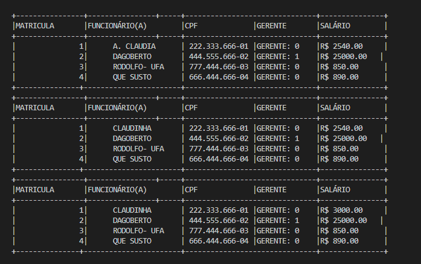
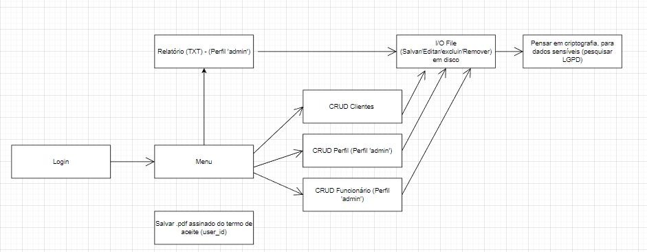

# Aceite Online
## O que é?
Um sistema desenvolvido na linguagem C.  
Possibilitando o operador:
- Listar / Cadastrar / Atualizar / Excluir => Funcionario (Caso gerente)
- Listar / Cadastrar / Atualizar / Excluir => Clientes
- Listar custo mensal da empresa


A brincadeira aqui usou alguns conceitos do C: 
- Conditional / Loop 
- Functions 
- Structs 
- Pointers and References
- Correção de acentuação no Windows (setLocale is Sux!)
- I/O Files Persistir em (.csv)  


### Copilar e Executar (local) ?!  
Execute o comando
```shell
gcc -o binary.exe worker.c && binary.exe
```

### Copilar pra 'prod' ?!
Execute o comando
```shell
gcc -o binary.exe worker.c && dist/aceite-online.exe
```

    


    
    


O restante está aqui:  
https://app.diagrams.net/#G1qRgqKxPBZyYuL1YDv5Tw2RoON5Od_gRE   
Ou uma versão estatica: `docs/fluxo_drawio.xml`  


Planilha de dados (storage/workers.csv)
https://docs.google.com/spreadsheets/d/1eMlOSFpCK09SJYl4bYadGosuIpcc6fSVmUAPV1VW3GI/edit?usp=sharing
    


## Dicas:
In VSCode:    
Utilizar Doxygen (Extensão)   

---------------------------------------------   
Estruturas utilizadas:

Worker (Worker)
```markdown
struct Worker
---------------------------------------------
int id;
char name[250];
char cpf[14];
int is_manager;
char gender[1];
float salary;
int is_deleted;
```


Consumer (Cliente)
```markdown
struct Consumer
---------------------------------------------
id: int;
name: char[250];
cpf: char[14];
gender: char[1];
```

Document (Documents)
```markdown
struct Documents
---------------------------------------------
id: int
consumer_id: int
path_file: char[250]
```


Topicos para estudar:  
- Malloc: https://www.programiz.com/c-programming/c-structures-pointers


